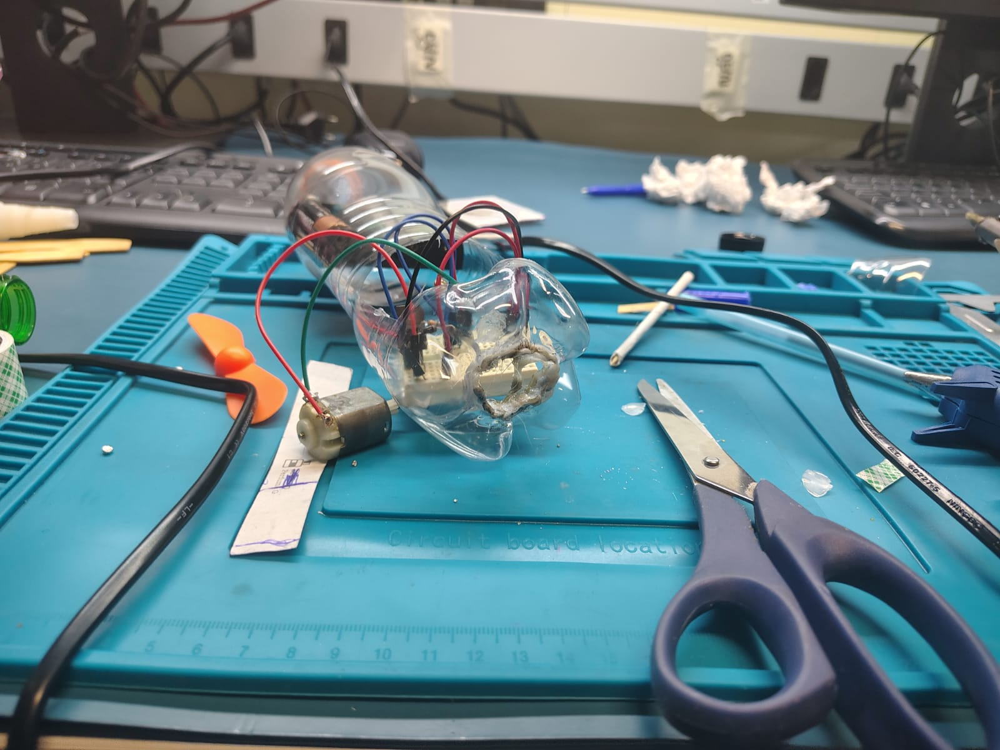

Shields.io (licença github)

# Carrinho mecatrônico
Projeto de um veiculo mecatrônico usando sucata de lixo eletronico.

## Autores 
- Vinicius Barel
- Giovanna Belmiro
- Lucas Lava Jato
- Gabriel

---
## Simulador do projeto
[Simulador](https://www.tinkercad.com/things/dhs5qvkH5vh-carrinho?sharecode=WlkPCpHVFSsRQa_VSa5UahKnBICxqWrRRmUGgMBVf7I)
